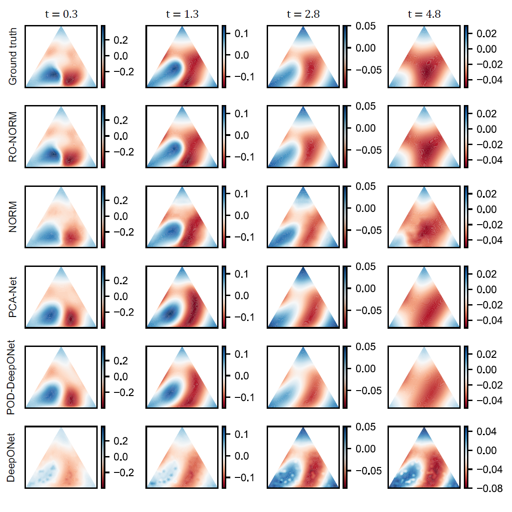
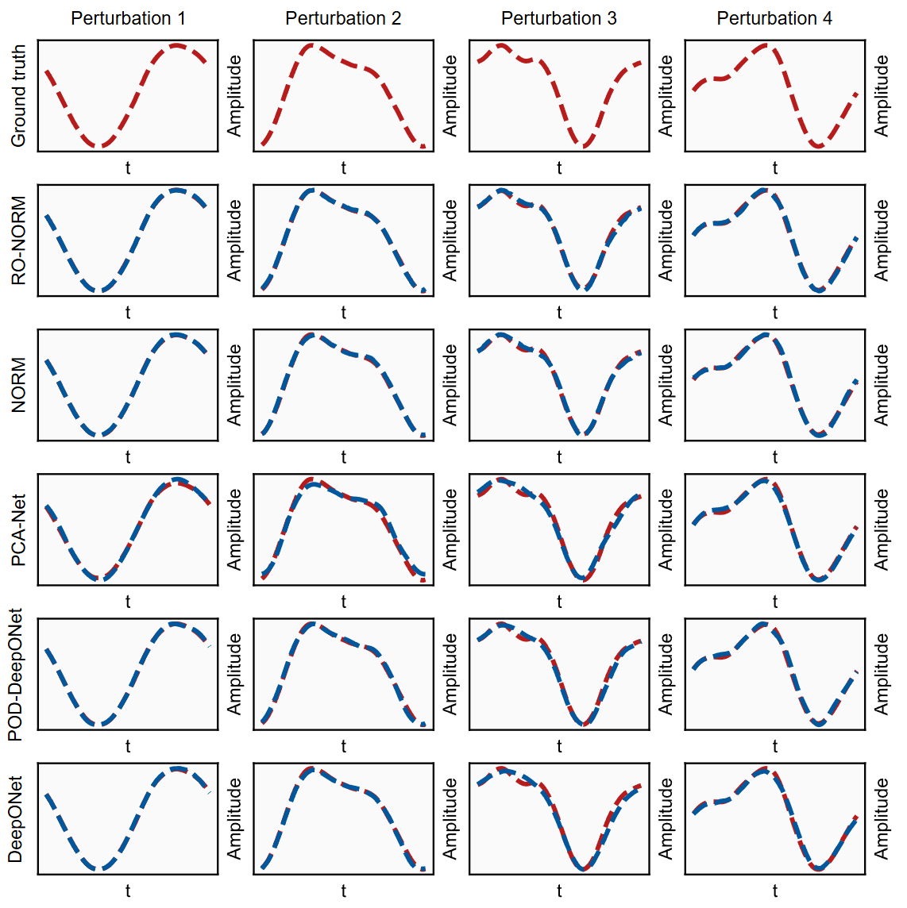
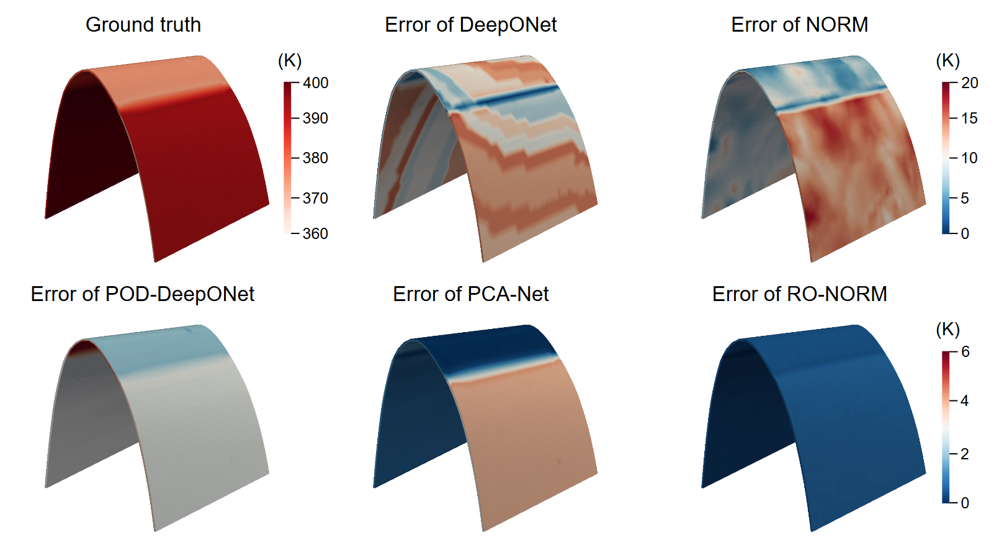
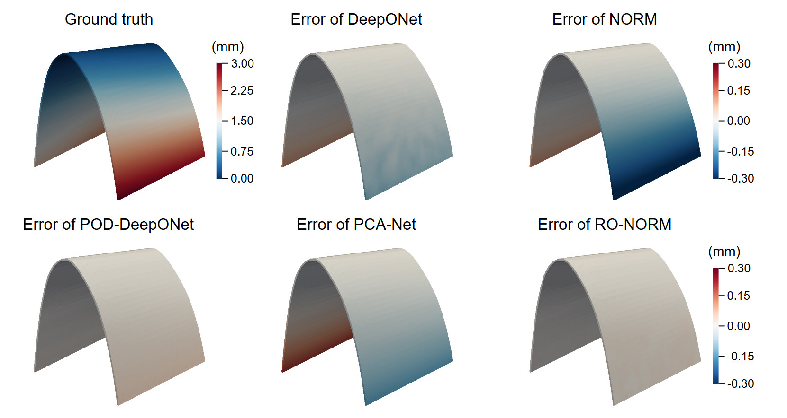

# A general reduced-order neural operator for spatio-temporal predictive learning on complex spatial domains


This repository contains code accompanying our paper ["A general reduced-order neural operator for spatio-temporal predictive learning on complex spatial domains"]. For questions, feel free to contact us (qlmeng@nuaa.edu.cn).

## Dependencies & packages
Dependencies:
* Python (tested on 3.8.11)
* PyTorch (tested on 1.8.0)

Additionally, we need an open-source Python package Lapy (https://github.com/Deep-MI/LaPy/tree/main) for differential geometry on triangle and tetrahedra meshes, which is used to calculate LBO basis. If you fail to install it, try to add the `lapy` folder included in our source code into your path.

## Data
The datasets of Case1-Case6 can be found in [here](https://drive.google.com/drive/folders/1FEat-Hn8rpvR33JDxPF6UROXee1626_1?usp=sharing). 
```
Case1-Burgers.mat
├── Input: U_initial  4000*415*100
└── Output: U_field   4000*415
---------------------------------------------
Case2-Wave.mat
├── Input: U_field   2000*100*506
└── Output: U_source  2000*100
---------------------------------------------
Case3-Layout.mat
├── Input: layout  1200*1168
└── Output: T_field 1200*1168*151
---------------------------------------------
Case4-Temperature.mat
├── Input: Tair_time   600*151*6
└── Output: T_field       600*151*2743
---------------------------------------------
Case5-Deformation.mat
├── Input: T_field       600*151*2743
└── Output: D_field   600*2743
---------------------------------------------
Case6-BloodFlow.mat
├── Input: `BC_time`(500*121*6)
└── Output: `velocity_x`(500*1656*121),`velocity_y`,`velocity_z`
```
## Usage

For all cases, you can directly run the codes by executing `main.py` to quickly obtain the results. Note that each experiment is repeated five times, the same setup as in our paper. Each case also retains the setting of hyperparameters in the paper.
```
python main.py 
```
Additionally, we provide the `Calculate_LBO_basis.py` in `datasets` folder to calculate the LBO basis for Case2, Case3 and Case4. The calculation of Case0 and Case1 are embedded in the corresponding `main.py`.

## Results
### Case1

---------------------------------------------------
### Case2

---------------------------------------------------
### Case3

---------------------------------------------------
### Case4

---------------------------------------------------
### Case5

---------------------------------------------------
### Case6

----------------------------------------------------


